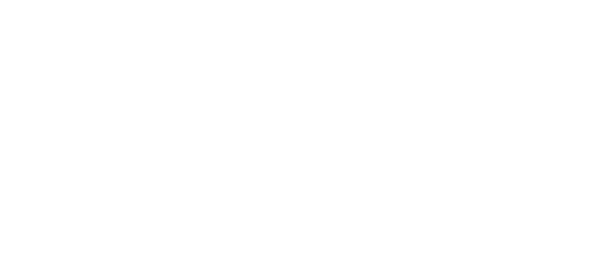

# Table of Contents

- [Table of Contents](#table-of-contents)
- [4WD Control Algorithms](#4wd-control-algorithms)
  - [Getting Started](#getting-started)
    - [Prerequisite Tools](#prerequisite-tools)
    - [OneDrive Documentation](#onedrive-documentation)
    - [Installing](#installing)
  - [Model Structure](#model-structure)
  - [Testing models with recorded data](#testing-models-with-recorded-data)
  - [Software-in-the-Loop testing](#software-in-the-loop-testing)
    - [Open Loop Tests](#open-loop-tests)
    - [Closed Loop Tests](#closed-loop-tests)
    - [Notes](#notes)
  - [Deployment](#deployment)
  - [Versioning](#versioning)
  - [License](#license)
  - [Acknowledgments](#acknowledgments)

# 4WD Control Algorithms
This repository contains multiple control algorithm blocks for developing independent 4WD control algorithms for the vehicle control unit.

## Getting Started

These instructions will get you a copy of the project up and running on your local machine for development and testing purposes. See deployment for notes on how to deploy the project on a live system.
   
1. If you haven't already, please install the pre-requesite software below.

### Prerequisite Tools

- [MATLAB](https://www.mathworks.com/products/matlab.html)

### OneDrive Documentation
- Additional hardware and system documentation for the AMS can be found on the OneDrive at **TBD****

### Installing

## Model Structure
All control algorithm models have a parent model .slx files located in the root folder **/models**. A template model is provided at **/models/model_template.slc** which gives each control algorithm a standardized interface of all the signals available, comptaible with signal test interfaces as well as the SIL MBD simulation project that is used for algorithm validation. Subfolders contain subsystem model blocks which are referenced in the parent models.

All torque-vectoring control systems typically follow this high-level cascade layout:

[image]

## Testing models with recorded data
[todo]

## Software-in-the-Loop testing
Control algorithm models can be validated using a software-in-the-loop process using the Simulink interfaces provided by MBD simulations such as Vi-Grade or IPG Carmaker. Currently we are waiting on IPG Carmaker licenses before evaluating each option and building a test interface. Algorithms should be validated for their preformance in a variety of ways:

### Open Loop Tests
- ISO 4128 constant speed steering pad
- ISO 7401 step steer manuever
- ISO 388 double lane change
- Decreasing turn radius slalom based on FSAE track layout rules

### Closed Loop Tests
- Hairpin corner test
- FSAE Skidpad
- Goodyear autocross test track
- FSAE endurance tracks (Michigan, F H+E, etc)

### Notes
- Test setups should reflect courses that can be tested in real life
- algorithms should be tested on varying tire-road mu levels (raining vs dry running)

## Deployment
[todo]

## Versioning

At the end of each vehicle season, the repository is copied and renamed for the new vehicle. The old repository is then archived.

## License

This project is licensed under the MIT License - see the [LICENSE.md](LICENSE.md) file for details

## Acknowledgments

* [README-Template](https://gist.github.com/PurpleBooth/109311bb0361f32d87a2)

